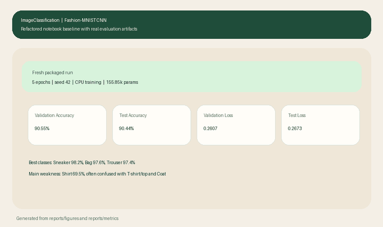

# ImageClassification

Baseline Fashion-MNIST classification project rebuilt from the original course notebook into a small, reproducible PyTorch repository.

<p align="center">
  
</p>

## Why This Repo Exists

This repository started as a notebook-only assignment and was refactored into a cleaner project structure to demonstrate two things:

- the ability to turn exploratory work into a reusable codebase
- the ability to discuss a computer vision baseline with proper training and evaluation hygiene

It is intentionally small. The goal is not to claim state-of-the-art performance on Fashion-MNIST, but to present a tidy and interview-friendly baseline that can be extended.

## Problem

The task is grayscale image classification on Fashion-MNIST:

- input: `1 x 28 x 28`
- classes: `10`
- dataset size: `60,000` training images and `10,000` test images
- objective: classify clothing category from a single image

## Approach

The model is a compact CNN derived from the original notebook:

- `Conv(1 -> 32)` + batch norm + ReLU
- `Conv(32 -> 64)` + batch norm + ReLU
- max pooling
- `Conv(64 -> 128)` + batch norm + dropout
- flatten + linear classifier

Training setup:

- optimizer: Adam
- loss: cross-entropy on raw logits
- normalization: Fashion-MNIST mean/std
- split policy: train/validation split from the training set, separate held-out test set
- reproducibility: seeded training and deterministic settings

## Repository Layout

```text
.
├── assets/
├── notebooks/
│   └── El_Bayad_Taha_assignment.ipynb
├── src/
│   └── image_classification/
│       ├── cli.py
│       ├── data.py
│       ├── engine.py
│       ├── infer.py
│       ├── metrics.py
│       ├── model.py
│       ├── plots.py
│       └── utils.py
├── tests/
├── pyproject.toml
└── README.md
```

## Quickstart

```bash
python -m venv .venv
source .venv/bin/activate
pip install -e .[dev]
```

Train the model and generate reports:

```bash
python -m image_classification --epochs 5 --batch-size 128 --seed 42
```

Or with the console script:

```bash
image-classification-train --epochs 5 --batch-size 128 --seed 42
```

Run single-image inference:

```bash
image-classification-infer path/to/image.png
```

## Outputs

Training produces:

- model checkpoint in `models/`
- learning curves in `reports/figures/`
- confusion matrix in `reports/figures/confusion_matrix.png`
- misclassified examples in `reports/figures/misclassified_examples.png`
- per-class metrics in `reports/metrics/`

## Results

Fresh run of the refactored package with `5` epochs, batch size `128`, and seed `42`:

- validation accuracy: `90.55%`
- validation loss: `0.2607`
- test accuracy: `90.44%`
- test loss: `0.2673`
- parameter count: `155.85k`
- compute: `18.72 MMac`

This is still a baseline result rather than a benchmark-optimized one, but it is a cleaner and stronger result than the original notebook baseline.

Metrics files:

- [reports/metrics/validation_metrics.md](reports/metrics/validation_metrics.md)
- [reports/metrics/test_metrics.md](reports/metrics/test_metrics.md)

## Per-Class Performance

Test-set per-class accuracy:

- T-shirt/top: `86.10%`
- Trouser: `97.40%`
- Pullover: `87.50%`
- Dress: `89.70%`
- Coat: `85.60%`
- Sandal: `96.40%`
- Shirt: `69.50%`
- Sneaker: `98.20%`
- Bag: `97.60%`
- Ankle boot: `96.00%`

The most difficult category is `Shirt`, which is frequently confused with `T-shirt/top`, `Coat`, and `Pullover`. That pattern is consistent with the visual similarity of upper-body garments in Fashion-MNIST and is the main weakness visible in the confusion matrix.


## Original Source

The original notebook is preserved here:

- [notebooks/El_Bayad_Taha_assignment.ipynb](notebooks/El_Bayad_Taha_assignment.ipynb)

## Credits

This repository is based on the original course notebook and preserves the original teaching-team credits:

- Lorenzo Lamberti
- Davide Nadalini
- Luca Bompani
- Luka Macan
- Francesco Conti

University of Bologna
